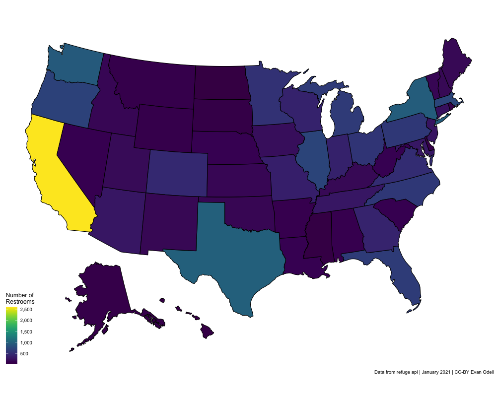

```{r setup, include = FALSE}
knitr::opts_chunk$set(
  collapse = TRUE,
  comment = "#>"
)
```


# Using `refuge`

[Refuge Restrooms](https://www.refugerestrooms.org/) "is a web application that seeks to provide safe restroom access for transgender, intersex, and gender nonconforming individuals." The web application includes a public API, which this package allows access to. The API does not require users to sign up or use a key. For further details on the API or the organisation behind it, see the [API docs](https://www.refugerestrooms.org/api/docs/), or the [Refuge Restrooms homepage](https://www.refugerestrooms.org/). `refuge` provides access to the Refuge Restrooms [API](https://www.refugerestrooms.org/api/docs/#!/restrooms) in R. 

Refuge Restrooms uses all user supplied data, which can be messy, and result in inconsistent coverage. It is nonetheless still useful. The example below shows how to convert US state names to the full name, including correcting a couple spelling mistakes, lowercased, and create a map showing the number of unisex, Americans with Disability Act (ADA) accessible restrooms in each state.

```{r, eval=FALSE}
library(refuge)
library(ggplot2)
library(dplyr, warn.conflicts = FALSE)
library(magrittr)
library(viridis)
library(stringi)
library(usmap)

all <- rfg_all_restrooms(accessible = TRUE, unisex = TRUE, 
                         verbose = TRUE, tidy = TRUE)

all <- all %>% filter(country == "US")

all$state <-  tolower(trimws(all$state))

all$state <- stri_replace_all_fixed(all$state, c("minnestoa", "californa"), 
                                    c("minnesota", "california"),
                                    vectorize_all = FALSE)

all$state <- case_when(all$state %in% tolower(state.name) ~ all$state,
                     all$state %in% c("washington dc", 
                                      "washington, district of columbia",
                                      "columbia", "DC",
                                      "washington district of columbia") ~
                       "District of Columbia", 
                     TRUE ~ tolower(state.name)[match(all$state, tolower(state.abb))])

all <- all %>% filter(!is.na(state)) %>%
  group_by(state) %>% 
  summarise(n_toilets=n())

p_toilets <- plot_usmap(data = all, values = "n_toilets") + 
  scale_fill_viridis(name = "Number of\nRestrooms", label = scales::comma) +
  scale_x_continuous(breaks = NULL) + 
  scale_y_continuous(breaks = NULL) +
  labs(x = "", y = "",
       caption = "Data from refuge API | January 2021 | CC-BY Evan Odell")

p_toilets


```


```{r us-map-show, echo=FALSE, out.width = '100%'}

```


All functions in `refuge` include parameters to limit queries to accessible and/or unisex restrooms.

